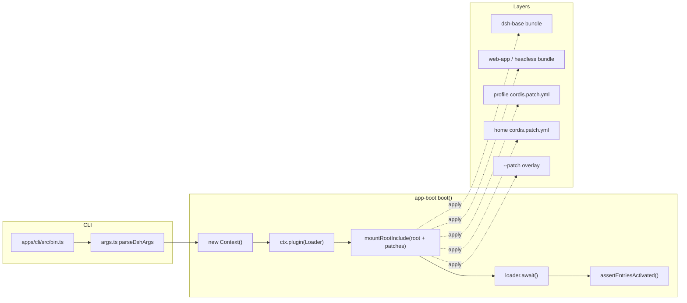
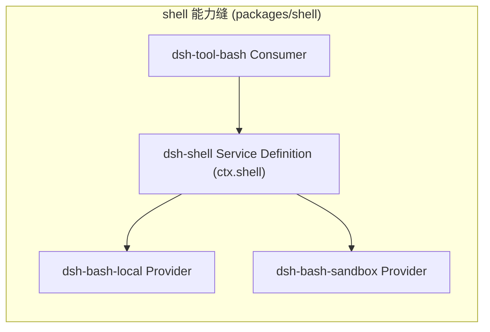

# DeepSeek Harness 系统架构

## 概述

DeepSeek Harness（`dsh`）是 DeepSeek AI 开发的开源 Agent 运行时框架。它不是一个单体应用，而是一个**基于 Cordis 插件体系的组合式平台**：模型适配器、工具注册表、会话日志、甚至 Agent 主循环本身，全部都是可替换的插件。这种"一切都是插件"的设计让用户无需修改核心代码，仅通过配置文件即可组装出适合自己场景的 Agent。

它的核心能力是驱动大语言模型完成多轮、多步骤的任务：Agent 每走一步会调用模型、根据模型输出执行工具（读写文件、执行 shell、搜索网页、调用子代理等），再把结果回传给模型，直到任务收敛。系统面向的用户是：需要把 Agent 能力嵌入自己产品的开发者、希望深度定制 Agent 行为的进阶用户，以及研究 Agent 编排的工程师。

系统在架构上的关键特征是：**运行时由插件树组合而成，树的内容完全来自可叠加的配置层**；**所有模型可见的信息都必须落进可持久化、可重放的会话日志**；**每一种可插拔能力都被抽象为"Service Definition / Service Provider / Consumer"三角色的能力缝**。

## 技术栈

**语言与运行时**
- TypeScript（严格模式，`strict: true`），ESM（`"type": "module"`）
- Node.js `^22.19 || >=24`，包管理器 pnpm `11.7.0`

**核心框架**
- Cordis：vendored 的插件框架（仓库内 `vendor/cordis`），提供 context、service、typed events、可逆 effect
- Schemastery：配置 schema 校验（vendored）
- cosmokit：Cordis 生态基础工具（vendored）

**构建与工程**
- tsdown：运行时打包（tsc 先产出 `lib/types`，tsdown 产出 bundle）
- vitest：单元测试 / 覆盖率 / 快照 / e2e
- oxlint：lint；jscpd：跨文件重复检测；knip：未使用依赖检测
- Lefthook：本地 git hooks；TypeScript 采用 Host/Client 两个 aggregate 的 Project References 布局
- Typert：仓库内自研的运行时类型图生成器，生成 API 网关所需的跨 Host/Client 反射产物

**数据存储**
- SQLite（会话持久化 `session-persistence-sqlite`，通用存储 `storage-sqlite`）
- JSONL（会话持久化 `session-persistence-jsonl`，可带 Zstandard 压缩）
- 文件系统（Harness home 目录 `$DSH_HOME`，默认 `~/.dsh`）

**运行时能力提供方**
- DeepSeek LLM 适配器（`llm-deepseek`，chat-completions）；第三方通过 `@earendil-works/pi-ai` 接入
- 本地子进程执行、bwrap/Landlock/Seatbelt/Windows ACL 沙箱（native：`@deepseek-ai/node-addon-landlock-run`）

**通信协议**
- Web UI：HTTP POST `/api/<method>` + WebSocket 事件流（默认 `127.0.0.1:3080`）
- SDK / Python SDK：子进程 stdio 上的换行分隔 JSON-RPC 2.0
- ACP：Agent Client Protocol，JSON-RPC stdio

**其他目录**
- Python：Python SDK 与打包运行时（`python/`）
- native：Landlock launcher 原生构建（`native/`）
- website：VitePress 文档站（`website/`）

## 项目结构

```
deepseek-harness/
├── apps/
│   ├── cli/            # dsh 命令行入口（bin.ts），profile 启动、插件管理、web 别名
│   └── web/            # Web 前端构建入口（Vite），引导 @deepseek-ai/dsh-client-web
├── packages/
│   ├── core/           # 产品 API 主干：session、tools、agent、agent-loop、system-prompt
│   ├── llm/            # LLM 能力家族：抽象服务 + DeepSeek/pi-ai 适配器
│   ├── fs/ shell/ web/ subprocess/ sandbox/ lsp/ skill/ subagent/ workflow/
│   │                   # 各"能力缝"家族：Service Definition + Providers + Consumers
│   ├── session/        # 会话持久化（JSONL/SQLite）、投影、标题、遥测
│   ├── host/ client/   # Web GUI 的 Node 半边与浏览器半边
│   ├── sdk/ acp/       # 进程外协议：SDK JSON-RPC 与 Agent Client Protocol
│   ├── bundle/         # 可安装的 profile patch 层（base / web-app / headless）
│   ├── boot/           # 共享 app-bin 启动胶水（app-boot、cmdline）
│   └── ...             # identity、settings、credentials、interaction、hooks、util 等
├── vendor/             # vendored 的 Cordis / cosmokit / schemastery 等固定版本源码
├── python/             # Python SDK（deepseek-harness-sdk）与打包运行时
├── native/             # Landlock launcher 原生源码
├── examples/           # 可运行的 cordis.yml 叶子：headless / web-cordis / acp / jsonrpc 等
├── docs/               # 架构、子系统、教程、cookbook 等文档
├── scripts/            # 构建脚本、repo 门禁、生成器
└── website/            # VitePress 文档站
```

**入口点**
- `apps/cli/src/bin.ts` — `dsh` 命令入口（源码启动：`pnpm dsh`）
- `apps/cli/lib/bin.js` — npm 发布后的 `dsh` bin（`npx @deepseek-ai/dsh web`）
- `apps/web/src/main.ts` — Web 前端入口，引导 `AppWebEntry`
- `packages/boot/app-boot/src/index.ts` — 插件树启动序列核心

## 运行时启动与组合

一个正在运行的 `dsh` 是**按顺序叠加多个配置层组合出的插件树**。

- **profile**（`$DSH_HOME/profiles/<name>`）：一个命名组合，声明它堆叠哪些 bundle、持有 out-of-tree 插件与用户自己的 `cordis.patch.yml`。`web` 与 `headless` 作为模板内置。
- **bundle**：Cordis 配置行 + 代码的发行格式。其 `package.json` 的 `dsh.bundle.patch` 指向它的 patch 文件。
- **patch 层**：按顺序应用——bundle 顺序 → profile 的 `cordis.patch.yml` → home 层的 `cordis.patch.yml` → 任意 `--patch` overlay。一个 patch 按行 id 整体替换 config，或插入新行。

```
dsh --profile web
  ├─ 空根配置 []（每次启动重写，防止 Loader 回写烘焙）
  ├─ 应用 @deepseek-ai/dsh-base 的 patch（所有 profile 共享的第一层）
  ├─ 应用 @deepseek-ai/dsh-web-app 的 patch（+ webserver、前端静态、浏览器 client 插件）
  ├─ 应用 profile 的 cordis.patch.yml（用户编辑，HMR 热重载）
  ├─ 应用 $DSH_HOME/cordis.patch.yml（机器级偏好）
  └─ 应用 --patch overlay（单次启动）
```



看自己的机器实际启动的树：

```sh
dsh --profile web --dump-config
```

任何打印出来的行都可以用你自己的 patch 覆盖。

## 核心包

以下包构成了产品 API 主干，`ctx.<key>` 是它们注册在 context 上的服务键。

| 包 | 职责 | `ctx` 键 |
|---|---|---|
| `core/session` | 追加式 `SessionEvent` 日志与内存 store | `ctx.sessions` |
| `core/system-prompt` | 提示词 section 与工具 schema 装配 | `ctx.systemPrompt` |
| `core/tools` | 作用域化工具注册表与受守卫的执行管线 | `ctx.tools` |
| `core/agent` | `Agent` 接口、活体注册表、`agent/*` 事件 | `ctx.agents` |
| `core/agent-loop` | 默认的 Agent 循环实现 | `ctx.agentLoop` |
| `core/scope` | 每-agent 作用域注册原语 | 纯库，无键 |
| `llm/llm` | 消息/流词汇 + 适配器接缝 | `ctx.llm` |

## 事件系统

事件是扩展点，选择正确的领域是大多数改动做出的第一个决定。

- **会话事件**：追加到日志的持久事实，经 `session/event` 广播。当一个事实必须在重载后存活时使用。
- **Agent 事件**（`agent/*`）：携带活体 `Agent`（inbox、step、status、request、validation、continuation）。用于观察或拦截正在飞行的工作。
- **能力事件**：把策略与适配器挂到某个能力缝（`fs/*`、`tools/*`、`telemetry/*`），不 import 循环。

Cordis 的四种派发模式：

| 模式 | 是否 await | 派发顺序 | 有返回值 |
|---|---|---|---|
| `emit` | 否 | 按注册顺序观察 | 否 |
| `waterfall` | 否 | 按注册顺序观察 | 是 |
| `parallel` | 是 | 全部并行观察 | 否 |
| `serial` | 是 | 按注册顺序观察 | 是 |

**waterfall 语义**：监听器收到 `(...args, next)`，调用 `next()` 委派（可能被包装的）结果给下一个；不调用则短路。策略类监听器用短路来独享决定，观察类监听器必须委派。

## Turn 流程

一次 **step** = 一次模型请求 + 它调用的工具。一次 **turn** = 零个或多个 step，从它的第一个输入被认领之前打开，直到没有亏欠的东西时关闭。

```text
turn/start
  claim 下一个 step 的输入 + 一条排队消息
  装配 prompt sections + tool schemas
  -> agent/pre-step                    reject | enter(messages)
     step/start
     把 enter 的消息追加为 user/message
     从日志派生模型历史
     agent/request -> llm/stream -> assistant/chunk* -> assistant/message
     tool/call* -> tools/pre-execute -> tools/execute -> tools/post-execute -> tool/result*
     step/end
     工具仍亏欠另一次请求，或下一个输入到达 -> claim -> 下一个 step
  -> agent/turn-stopping
turn/end
```

`turn/*`、`step/*`、`user/message`、`assistant/*`、`tool/*` 是持久会话事件；其余是分布在三个领域的活体扩展点。`agent/pre-step`、`agent/request`、`llm/stream` 与三个 `tools/*` 事件是 waterfall，其监听器必须调用 `next()` 委派；`agent/turn-stopping` 是串行的、没有 `next()`。

```mermaid
sequenceDiagram
    participant Loop as "agent-loop driver"
    participant Session as "ctx.sessions (log)"
    participant Prompt as "ctx.systemPrompt"
    participant LLM as "ctx.llm"
    participant Tools as "ctx.tools pipeline"
    Loop->>Loop: claim next-step input + one queued message
    Loop->>Prompt: assemble sections + tool schemas
    Prompt-->>Loop: PromptAssembly
    Loop->>Session: append user/message
    Loop->>LLM: agent/request -> llm/stream
    LLM-->>Loop: assistant/chunk* -> assistant/message
    Loop->>Tools: tools/pre-execute -> execute -> post-execute
    Tools-->>Loop: tool/result*
    Loop->>Session: append tool/result
```

## 会话日志

会话日志是模型所见上下文的来源。`deriveMessages()` 从它投影出模型历史，原始 `assistant/chunk` 事件保持回放与 UI 保真度。fork、resume、transcript、遥测、持久化都从这条流派生。

**模型可见 ⟺ 已记录。** 任何到达模型请求的东西必须能从日志重建，运行时不变量断言这一点。这就是为什么新的模型可见输入需要新的会话事件：扩展 `SessionEventMap` 并从日志渲染。

一条 `SessionEvent` 是带 `seq` 单调序号、`time` 毫秒时间戳、按 `type` 判别 data 的不可变条目。`SessionEventMap` 是可声明合并的映射，插件通过 `declare module` 添加自己的事件类型。

## 能力缝

**能力缝** = 一个可换能力，包含三个角色：**Service Definition**（声明接口的抽象 Cordis `Service`，拥有 `ctx.<key>` 与词汇类型）、**Service Provider**（实现它）、**Consumer**（使用它，通常是模型面工具）。能力缝必须三角色齐全。



能力缝是"换一个 provider 就换整个产品"的原因：文件系统与子进程 provider 共享同一执行世界，把 `ctx.fs` 指向远程沙箱，Bash、PTY、LSP 一起搬走，无需分叉 provider。

## 新的行为放在哪

| 目标 | 机制 |
|---|---|
| 加一个模型 provider | 在 `ctx.llm` 上注册其适配器 |
| 加一个模型面能力 | 在 `ctx.tools` 上注册；其 schema 加入 prompt 装配 |
| 给某个会话不同的能力集 | 组合一个 agent preset |
| 加 shell 执行 | 注册 `ctx.shell` 后端；local 实现经 `ctx.subprocess` spawn |
| 加持久终端执行 | 注册 `ctx.terminals` 后端 + `dsh-tool-terminal` |
| 加人类命令 | 在 `ctx.commands` 上注册；无需模型 turn 即可派发 |
| 加后台工作 | 在 `ctx.jobs` 上注册；`job_*` 工具收集或停止它 |
| 加文件系统访问或策略 | 注册 `ctx.fs` provider 或监听 `fs/*` 事件 |
| 约束产生的进程 | 用 `ctx.sandbox` 后端；consumer 在 spawn 前包装 argv |
| 拦截请求、工具或 turn | 用它的 `agent/*` 或 `tools/*` 事件；`agent/turn-stopping` 停止 turn |
| 加模型面上下文 | 调 `agent.inject()`；落到下一个被接纳的请求 |
| 加 UI 或编辑器集成 | 驱动 `ctx.agents`，从 `session/event` 渲染 |
| 加持久会话状态 | 扩展 `SessionEventMap`；从日志渲染与回放 |
| 生成会话标题 | 注册唯一的 `ctx.sessionTitle` provider |
| fork 一个活会话 | `ctx.sessions.fork(source, boundary?, childSessionId?)` |
| 把注册作用域限定到一个 agent | 用该 agent 的 `agent.ctx` |

## 进程外接口

系统为不同调用方暴露了三种进程外接口：

| 场景 | 传输 | 主要方法 |
|---|---|---|
| 浏览器 ↔ host（Web GUI） | HTTP POST `/api/<method>`、`/api/respond` + 2 条 WebSocket 下行 | `session.prompt`、`host.describe`、`events.mux` 帧 |
| TS/Python SDK ↔ 运行时 | 子进程 stdio，换行分隔 JSON-RPC 2.0 | `initialize`、`session/prompt`、`shutdown`；下行 `session.event` |
| ACP 客户端 ↔ harness | stdio NDJSON（ACP 规范） | `session/new`、`session/prompt`、`session/cancel`、`session/request_permission` |

三者的共同纪律是"只提交已确认的输出"：模型原始增量、推理与工具活动不上自动化 wire；Web GUI 则是全量事件流。
