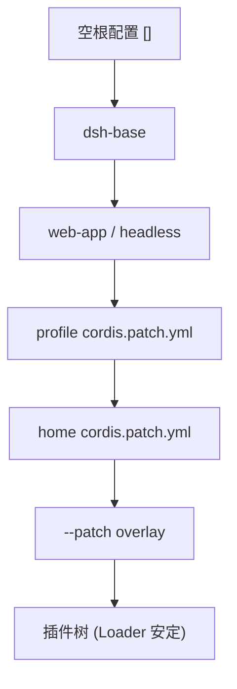

# Profile 与 Bundle

DeepSeek Harness 的运行时不写死在代码里，而是由配置层组合出来。Profile 与 Bundle 是这个组合机制的两块基石。

## 什么是 Profile？

**Profile** 是 `$DSH_HOME/profiles/<name>` 下的一个目录（`$DSH_HOME` 默认 `~/.dsh`），包含：

- `package.json`：out-of-tree 插件依赖 + profile 清单 `dsh.profile.bundles`（有序 bundle 名列表）
- `cordis.patch.yml`：用户自己的 patch 层，应用在所有 bundle 层之后
- `pnpm-workspace.yaml`：out-of-tree 插件需要的 pnpm 设置

`web` 与 `headless` 作为模板内置：

| 模板 | 堆叠的 bundles |
|---|---|
| `web` | `[base, web-app]` |
| `headless` | `[base, headless]` |

## 什么是 Bundle？

**Bundle** 是一个 npm 包，其 `package.json` 声明 `dsh.bundle.patch` 指向它的 patch 文件。bundle 的实质就是它的 `cordis.patch.yml`——一个把插件行插入树的补丁。

三个内置 bundle：

| Bundle | 一句话职责 |
|---|---|
| `@deepseek-ai/dsh-base` | 所有 profile 共享的第一层：模型适配器、工具、持久化、sandbox/approval 策略、settings、credentials、遥测等 100+ 行 |
| `@deepseek-ai/dsh-web-app` | 在 base 之上加 webserver（默认 127.0.0.1:3080）、前端静态 dist、浏览器 client 插件 roster、agent-presets 层 |
| `@deepseek-ai/dsh-headless` | 一次性无头任务模式：创建 Agent、驱动到 quiescence、输出最终文本后以 0/1 退出，不挂 Host/HTTP/browser |

## 组合机制

一个运行中的 `dsh` 是空 entry 列表上按顺序应用以下层的结果（后者覆盖前者）：

1. bundle 层（`dsh.profile.bundles` 顺序）
2. profile 用户层（`cordis.patch.yml`，HMR 热重载）
3. home 层（`$DSH_HOME/cordis.patch.yml`，机器级偏好）
4. `--patch` overlay（单次启动）



## 查看你的树

```sh
dsh --profile web --dump-config
```

任何打印出来的行都可以用你自己的 patch 覆盖。整棵树由 Loader 经 `cordis:include` 根挂载，`assertEntriesActivated` 审计每个 fiber 的激活状态。

## 代码位置

| 方面 | 位置 |
|------|------|
| profile/bundle 概念 | `packages/boot/app-boot/src/profile.ts` |
| 启动序列 | `packages/boot/app-boot/src/index.ts` |
| CLI 组合逻辑 | `apps/cli/src/profile-boot.ts` |
| base patch | `packages/bundle/base/cordis.patch.yml` |
| web patch | `packages/bundle/web-app/cordis.patch.yml` |

## 不变量

1. **Patch 替换 config，不是合并**：`{ id: X, config: {...} }` 整体替换目标行 config，重述的行必须写全所有键。
2. **同一行的最后一个写者获胜**：上层 patch 覆盖下层。
3. **缺失 patch 静默跳过，无法解析的 patch 必须 fail loud**。
