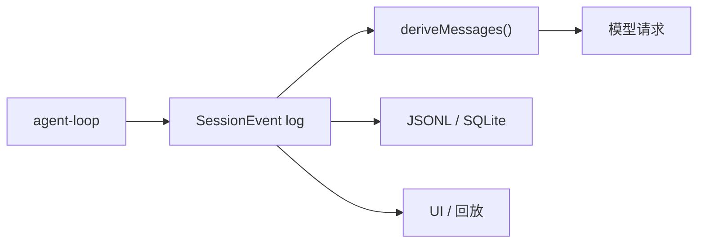

# 会话日志

会话日志（session log）是 DeepSeek Harness 的"真相之源"：模型所见上下文来自它，回放、fork、resume、transcript、遥测、持久化都从它派生。

## 什么是会话日志？

会话日志是一条**追加式（append-only）**的 `SessionEvent` 流。`Session` 类持有内存日志（`static create/fromRestore`，`append(type, data)` 提交，`events` 不可变快照），`SessionStore`（`ctx.sessions`）管理会话生命周期。

一条 `SessionEvent` 是按 `type` 判别的可辨识联合：

```ts
type SessionEvent<T> = {
  type: K
  seq: number        // 会话内单调递增序号
  time: number       // Unix epoch 毫秒
  data: SessionEventMap[K]
  ignorable?: true   // 缺省 = 必读
}
```

**关键特征**：
- `SessionEventMap` 是 merge 可扩展的声明合并映射，插件用 `declare module` 加自己的事件类型
- `ignorable?: true` 表示纯信息记录；缺省表示"必读"——读者遇到不认识的必读类型必须拒绝重建会话
- surface 事件（`user/message`、`assistant/message`、`tool/result`）携带 `surfaceOp`（`'append'` 或 `{op:'replace', start, end}`，供 compaction）与 `sourceEventSeqs`
- **模型可见 ⟺ 已记录**：任何到达模型请求的东西必须能从日志重建；运行时不变式断言这一点

## 持久化

内存日志经持久化缝落盘，有后端抽象 `SessionPersistence`（`ctx.sessionPersistence`）：

| 后端 | 包 | 说明 |
|---|---|---|
| JSONL | `session/session-persistence-jsonl` | 按 project/session 目录布局；首行 `SessionHeader` 头记录，其后每行一条事件；可选 Zstandard 压缩（`.jsonl.zstd`） |
| SQLite | `session/session-persistence-sqlite` | 单物理事件行可打包多条逻辑事件；`SCHEMA_VERSION = 17` 单调递增，版本不符直接拒绝打开 |

## 派生机制

- `deriveMessages()`：从日志投影模型历史
- 原始 `assistant/chunk` 事件保持回放与 UI 保真度
- fork、resume、transcript、遥测、持久化都从这条流派生



## 事件类型

持久事件域：`turn/*`、`step/*`、`user/message`、`assistant/*`、`tool/*`、`session/created`、`session/disposed` 等。新增模型可见输入必须新增会话事件（扩展 `SessionEventMap` 并从日志渲染）。

## 代码位置

| 方面 | 位置 |
|------|------|
| `SessionEvent` 类型 | `packages/core/session/src/types.ts` |
| `Session` / `SessionStore` | `packages/core/session/src/index.ts` |
| surface 折叠 | `packages/core/session/src/surface.ts` |
| JSONL 后端 | `packages/session/session-persistence-jsonl/src/format.ts` |
| SQLite 后端 | `packages/session/session-persistence-sqlite/src/schema.ts` |

## 不变量

1. **模型可见 ⟺ 已记录**：新模型可见输入必须落进日志并可重建；没有会话事件就没有模型可见输入。
2. **`SessionEventMap` 成员默认必读**：构建时不知道某事件类型就必须拒绝该日志，除非事件携带 `ignorable: true`。
3. **只在提交点发布状态**：每个通知与派生状态只在操作成功后才发出。
