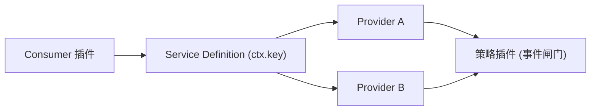

# 能力缝

能力缝（capability seam）是 DeepSeek Harness 让每种能力可替换的核心机制。它把"一个能力"拆成三个职责角色，三者齐全才算一个完整能力。

## 什么是能力缝？

能力缝 = 一个可换能力，由三个角色组成：

| 角色 | 职责 | 载体 |
|---|---|---|
| **Service Definition** | 抽象服务契约：继承 Cordis `Service` 的抽象类（或如 `WebRuntime` 的注册表类）、`ctx.<key>` 类型声明、请求/结果词汇、事件闸门词汇 | 抽象服务类 + `declare module` 类型合并 |
| **Service Provider** | 抽象类的具体实现，注册为 `ctx.<key>`；一个能力可有多个实现 | 继承抽象类的具体类，default-export |
| **Consumer** | 注入服务并消费的插件：模型面工具、策略插件或上层编排 | 函数插件，named-export `name`/`inject`/`Config`/`apply` |

**关键特征**：
- 能力缝是完整能力，永远不止一个角色；把能力拆成三角色时才叫"缝"
- 换一个 provider 就换掉整个产品行为——consumer 从不 import 具体 provider
- 角色通常分处独立包（当它们独立演化时）；也可合并（当是同一关切时）

## 示例：filesystem（`packages/fs/`）

- **Definition**：`fs/fs` — `abstract class FileSystem extends Service`（`ctx.fs`），抽象方法 `resolve` / `readText` / `writeText` / `editText` / `listDir` 等；声明 `fs/write-intent`、`fs/edit-intent`（waterfall）、`fs/observed`（emit）事件
- **Providers**：`fs/fs-local`（本地文件系统）、`fs/fs-sandbox`（按 per-call sandbox mode 围栏写/编辑）
- **Consumers**：`fs/tool-fs`（模型面 `read`/`write`/`edit` 工具）、`fs/tool-fs-search`、`fs/tool-str-replace-editor`
- **策略插件（第四个形态）**：`fs/fs-observation-policy` 经 `fs/*` 事件闸门加 observed-state / read-before-edit / 版本守卫写，不改变 provider 契约

## 示例：shell（`packages/shell/`）

- **Definition**：`shell/shell` — `abstract class ShellExecutor extends Service`（`ctx.shell`），`resolve(request): ShellExecSpec` / `run(spec)` / `start(spec)`
- **Providers**：`shell/bash-local`、`shell/bash-sandbox`（每条命令经 `ctx.sandbox` 围栏）、`shell/pwsh-local`、`shell/pwsh-sandbox`
- **Consumers**：`shell/tool-bash`、`shell/tool-bash-persistent`、`shell/tool-pwsh`

## 代码位置

| 方面 | 位置 |
|------|------|
| fs 缝 | `packages/fs/fs/src/index.ts`（Definition）、`packages/fs/fs-local/`、`packages/fs/tool-fs/` |
| shell 缝 | `packages/shell/shell/src/index.ts`（Definition）、`packages/shell/bash-local/`、`packages/shell/tool-bash/` |
| 能力缝图 | `docs/capability-seams.md` |
| 设计记录 | `.agents/notes/implemented/architecture/2026-06-13-capability-seams.md` |

## 关系

## 不变量

1. **缝必须三角色齐全**：只有 Definition 或只有 Consumer 都不是能力缝。
2. **扩展插件依赖 Definition，绝不依赖具体 provider**：`dsh-agent-loop` 可换，UI/hook/tool 插件只用 `dsh-agent`。
3. **Design Definition for all current Consumers**：不要让单个 Consumer 独裁服务契约；工具 schema、Loader、UI、transport 相关行为留在 Consumer 或 provider 里。
